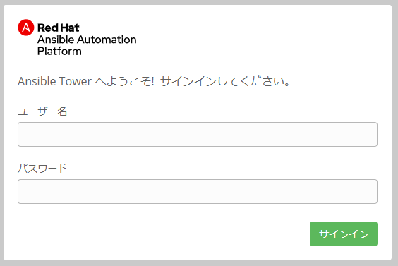
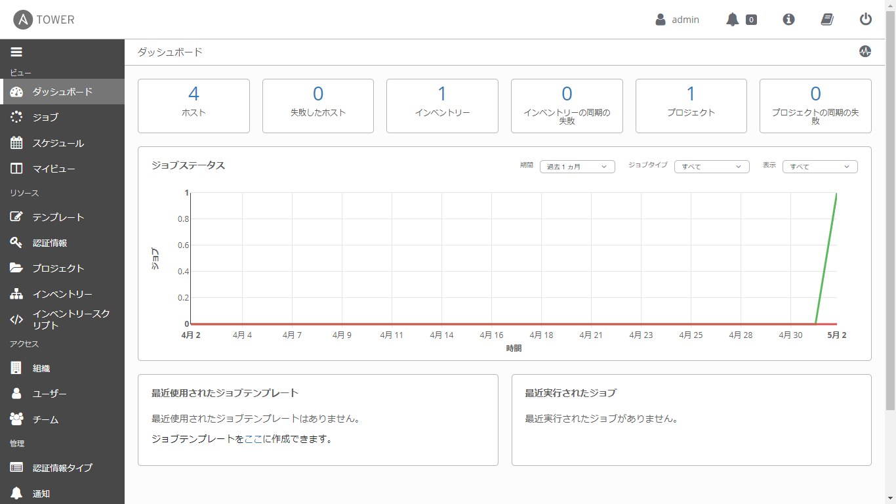
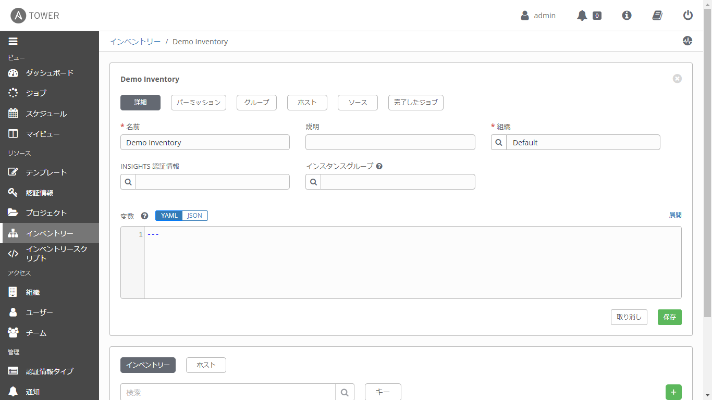
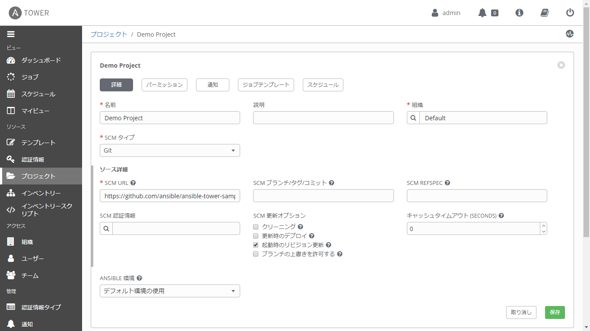
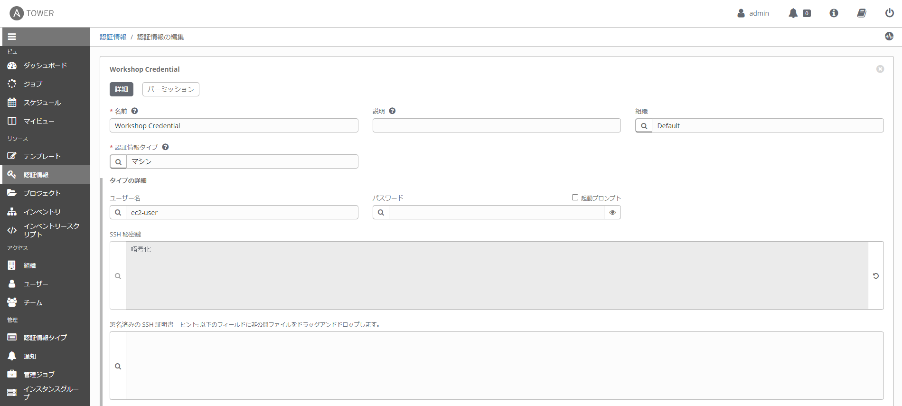
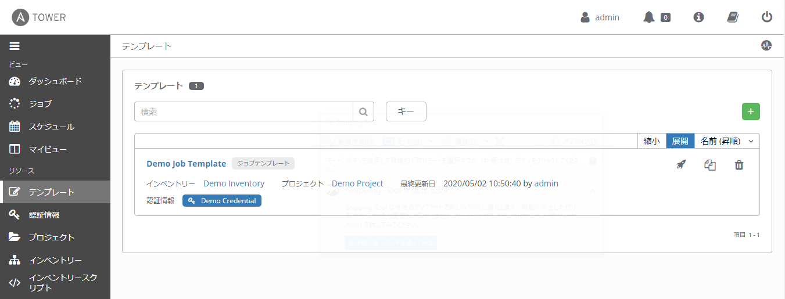

# 演習 4.0: Red Hat Ansible Tower環境の確認

**Read this in other languages**:  [English](README.md),   [日本語](README.ja.md).

## 目次
- [目的](#目的)
- [解説](#解説)
- [まとめ](#まとめ)
- [完了](#完了)

# 目的

Ansible Tower は、ビジュアルダッシュボード、ロールベースのアクセス制御、ジョブスケジューリング、統合通知、グラフィカルなインベントリーマネジメントを使用して IT インフラストラクチャを一元管理および制御できる Web ベースのソリューションです。Ansible Tower には、WebUI に加えて RESTAPI と CLI が含まれています。

このラボでは、Tower にログインして、F5 BIG-IP デバイスに対し自動化タスクを実行するために後のラボで使用されるいくつかの基本的な構成を実行します。この演習では、以下について説明します。
- コントロールノードで実行されている Ansible バージョンの確認
- 配置と理解:
  - **インベントリー**
  - **認証情報**
  - **プロジェクト**
  - **テンプレート**

# 解説

## Step 1: Ansible Automation Platform へログイン

Webブラウザーを開き、Ansible コントロールノードの DNS 名を入力します。

>たとえば、student1 ワークベンチが割り当てられ、ワークショップ名が `durham-workshop` の場合には、次のようになります:

**https://student1.durham-workshop.rhdemo.io**

>このログイン情報は、講師から提供されます。

- ユーザ名: `admin`
- パスワード: 講師から指示されたパスワード

ログイン後、ジョブダッシュボードは以下のようにデフォルトの表示になります。

1.  ユーザーインターフェースの右上にある **i** 情報ボタンをクリックします。

    

2.  次のようなウィンドウがポップアップ表示されます。

    

    ここでは、Ansible Tower バージョンと Ansible Engine バージョンの両方が表示されていることに注意してください。

## Step 2: インベントリーの確認

Red Hat Ansible Tower がジョブを実行できるようにするには、インベントリーが必要です。インベントリーは Ansible インベントリーファイルと同じように、ジョブを起動するホストのコレクションです。さらに Red Hat Ansible Tower は ServiceNow や Infoblox DDI などの既存の構成管理データベース (cmdb) を利用できます。

>Ansible Tower に関するインベントリーの詳細については、 [こちらのドキュメントをご覧ください](https://docs.ansible.com/ansible-tower/latest/html/userguide/inventories.html)

1. 左側のメニューバーの **リソース** の下にある **インベントリー** ボタンをクリックします。

    

2. **インベントリー** の中にある `Demo Inventory` をクリックしてください。

3. `Demo Inventory` の下にある 上部の **ホスト** ボタンをクリックします。ここには構成されたホストが表示されます。ホストの1つをクリックします。

4. ページ上部にある `Demo Inventory` をクリックし、トップレベルのメニューに戻ります。

5. **グループ** をクリックします。ここではホストのグループを設定できます。
    

## Step 3: プロジェクトの確認

プロジェクトは、Ansible Playbook を Red Hat Ansible Tower にインポートする方法です。Playbook と Playbook ディレクトリを管理するには、Ansible Tower サーバーの Project Base Path に手動で配置するか、Git、Subversion、Mercurial などのTower がサポートするソースコード管理（SCM）システムに Playbook を配置することで管理できます。

> Tower のプロジェクトの詳細については [こちらをご覧ください](https://docs.ansible.com/ansible-tower/latest/html/userguide/projects.html)

1. 左側のメニューバーの **リソース** の下にある **プロジェクト** ボタンをクリックします。

    

2. **プロジェクト** の下には事前に準備された `Ansible official demo project` が一つあります。オブジェクトをクリックして開きます。

    `GIT`がこのプロジェクトにリストされていることに注意してください。これは、このプロジェクトがSCMに`Git`を使用していることを意味します。

3. `Ansible official demo project` の下の **SCM タイプ** ドロップダウンメニューをクリックしてください。

    Git、Mercurial、Subversion が選択肢の一部であることに注意してください。プロジェクトが引き続き正しく機能するように、Git を選択します。

## Step 4: 認証情報の確認

認証情報は、Red Hat Ansible Automation Platform によって、マシンに対して **ジョブ** を起動するときの認証、インベントリソースとの同期、およびバージョン管理システムからのプロジェクトコンテンツのインポートに使用されます。ワークショップでは、ネットワークデバイスを認証するための資格情報が必要です。

> Tower に関する認証情報の詳細については、 [こちらのドキュメントをご覧ください](https://docs.ansible.com/ansible-tower/latest/html/userguide/credentials.html).

1. 左側のメニューバーの **リソース** の下にある **認証情報** ボタンをクリックします。

    

2. **認証情報** の下には、事前に構成された認証情報の `Workshop Credential` と `Tower Credential` があります。`Workshop Credential` をクリックします。

3. `Workshop Credential` の下で次のことを確認します。
    - **認証情報タイプ**: マシン
    - **ユーザー名**: `admin`
    - **パスワード**: 既に設定されており、**暗号化** されています
    - **SSH 秘密鍵**: 空白

## Step 5: テンプレートの確認

テンプレートまたはジョブテンプレートは、Ansible Playbook を実行するときに使用されるパラメーターを定義します。これらのパラメーターには、使用するプロジェクトやインベントリーなど、前述の機能が含まれています。さらに、ロギングレベルやプロセスフォークなどのパラメーターにより、Playbook の実行方法をさらに細かく設定できます。

1. 左側のメニューバーの **リソース** の下にある **テンプレート** ボタンをクリックします。

    

2. **テンプレート** の下には、事前に構成された`INFRASTRUCTURE/Turn off IBM Community Grid` があります。オブジェクトをクリックします。

# まとめ

- Ansible Automation Platform は、Ansible Playbook を実行するためのインベントリーが必要です。このインベントリーは、コマンドラインの Ansibleで使用するものと同じです
- Ansible Automation Platform は、`GitHub`を含むSCM(source control management)と同期できます
- Ansible Automation Platform は、SSH 秘密鍵やプレーンテキストのパスワードを含む資格情報を保存および暗号化できます。Ansible Automation Platform は、HashiCorp の CyberArk や Vault などの既存の認証情報ストレージシステムと同期することもできます
- ジョブテンプレートは、Ansible Playbook を実行するときに使用されるパラメーターを定義します

---

# 完了

演習 4.0 が完了しました。

これで、Ansible AutomationPlatform の使用を開始するために必要な3つのコンポーネントすべてを確認しました。インベントリー、プロジェクトおよび認証情報です。次の演習では、ジョブテンプレートを作成します。

[Ansible F5 Network Automation Workshopに戻るには、ここをクリックしてください](../README.ja.md)
