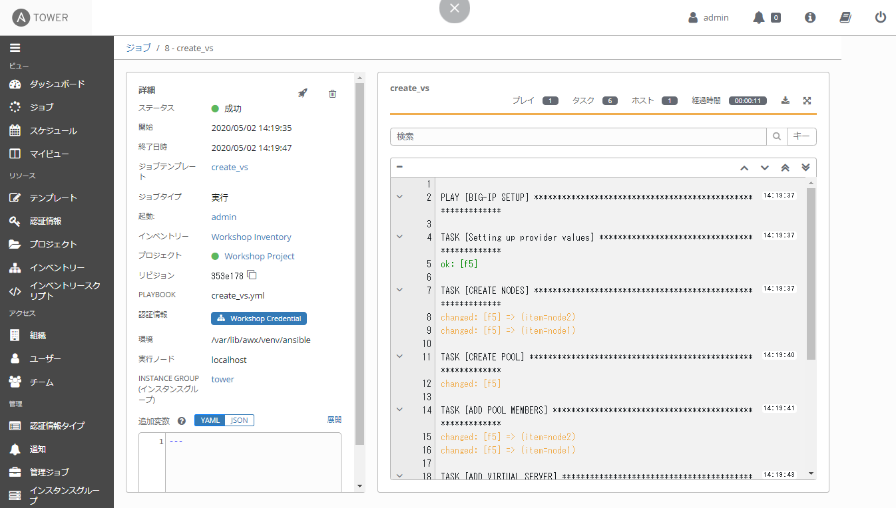

# 演習 4.1: Tower ジョブテンプレートの作成

**Read this in other languages**:  [English](README.md),   [日本語](README.ja.md).

## 目次
- [目的](#目的)
- [解説](#解説)
- [まとめ](#まとめ)
- [完了](#完了)

# 目的

Red Hat Ansible Tower の BIG-IP 仮想サーバー構成ジョブテンプレートをデモします。このジョブテンプレートは、仮想サーバーとプールを作成し、2つの Web サーバーをプールに追加します。

Ansible Tower で Ansible Playbook を実行するには、**ジョブテンプレート** を作成する必要があります。**ジョブテンプレート** には以下が必要です。

 - デバイスにログインするための **認証情報**
 - ジョブを実行するための **インベントリー**
 - Playbook が含まれる **プロジェクト**

# 解説
## Step 1: プロジェクトを作成する
1. Web UI を開き、左側のメニューバーから **リソース** セクションの下にある **プロジェクト** をクリックします。

2. 緑色のボタンをクリックして、新しくプロジェクトを作成します。

3. 以下の通りにパラメータを入力し、**保存** をクリックします。 

    | パラメータ                   | 値                   |
    |------------------------------|----------------------|
    | 名前                         | Workshop Credential  |
    | 組織                         | Network              |
    | SCM タイプ                   | admin                |
    | SCMURL                       | ansible              |
    | リリース時にリビジョンを更新 | ?                    |

> Note: ご使用の環境には、追加のプロジェクトがセットアップされている場合があります。各プロジェクトは、Ansible Playbook のリポジトリを表します。複数のプロジェクトがあるのは正常です。

  

すべての Playbook は https://github.com/f5devcentral/ansible-tower-workshop-examples から入手でき、各 Playbook を確認することができます。

参考に、インポートされている、このラボの後半で実行される Playbook の一つを次に示します。

**`create_vs.yml`**

``` yaml
---
- name: BIG-IP SETUP
  hosts: lb
  connection: local
  gather_facts: false

  tasks:
    - name: Setting up provider values
      set_fact:
       provider:
        server: "{{private_ip}}"
        server_port: "8443"
        validate_certs: "False"
  
    - name: CREATE NODES
      bigip_node:
        provider: "{{provider}}"
        host: "{{hostvars[item].ansible_host}}"
        name: "{{hostvars[item].inventory_hostname}}"
      loop: "{{ groups['web'] }}"

    - name: CREATE POOL
      bigip_pool:
        provider: "{{provider}}"
        name: "http_pool"
        lb_method: "round-robin"
        monitors: "/Common/http"
        monitor_type: "and_list"

    - name: ADD POOL MEMBERS
      bigip_pool_member:
        provider: "{{provider}}"
        state: "present"
        name: "{{hostvars[item].inventory_hostname}}"
        host: "{{hostvars[item].ansible_host}}"
        port: "80"
        pool: "http_pool"
      loop: "{{ groups['web'] }}"

    - name: ADD VIRTUAL SERVER
      bigip_virtual_server:
        provider: "{{provider}}"
        name: "vip"
        destination: "{{private_ip}}"
        port: "443"
        enabled_vlans: "all"
        all_profiles: ['http','clientssl','oneconnect']
        pool: "http_pool"
        snat: "Automap"

    - name: PRINT OUT WEB VIP FOR F5
      debug:
        msg: "The VIP (Virtual IP) is https://{{ansible_host}}"
```

## Step 2: BIG-IP 認証情報の作成
ジョブを作成する前に、BIG-IP に対して認証するための資格情報を作成する必要があります。

1. Web UI を開き、左側のメニューバーから **リソース** セクションの下にある **認証情報** をクリックします。

2. 緑色の ボタンをクリックし、新しく認証情報テンプレートを作成します。

3. 以下の通りに、認証情報パラメータをフィールドに入力します。

| パラメータ | 値 |
|---|---|
| 名前 | BIGIP |
| クレデンシャルタイプ | Network |
| ユーザ名 | admin |
| パスワード |  |

NOTE: パスワードは、学生ラボ情報が含まれているWebページのワークベンチ情報セクションにあります。パスワードがわからない場合は、インストラクターに相談してください。

4. **保存** をクリックします。

## Step 3: ジョブテンプレートの作成
1. Web UI を開き、左側のメニューバーから **リソース** セクションの下にある **テンプレート** をクリックします。

2. 緑色の ボタンをクリックし、新しくジョブテンプレートを作成します。

3. 以下の通りにパラメータを入力します。

| パラメータ     | 値                 |
|----------------|--------------------|
| 名前           | create_vs          |
| ジョブタイプ   | 実行               |
| インベントリー | Workshop Inventory |
| プロジェクト   | Workshop Project   |
| Playbook       | create_vs.yml      |
| 認証情報       | BIGIP              |

認証情報タイプから `Network` を選択し、次に `BIGIP` を選択します。

これは、パラメータが入力されたジョブテンプレートのスクリーンショットです。

4. 下にスクロールして、緑色の **保存** ボタンをクリックします。

## Step 4: ジョブテンプレートの起動

1. 全てのテンプレートが一覧表示されている **テンプレート** ウインドウに戻ります。

2. ロケットボタンを押して、`create_vs` を起動します。

    

    ロケットボタンをクリックすると、ジョブが起動します。**ジョブ詳細表示** という新しいウインドウを開き確認します。[Tower Jobs](https://docs.ansible.com/ansible-tower/latest/html/userguide/jobs.html)の詳細については、ドキュメントを参照してください。

## Step 5: ジョブ詳細表示の確認

左側には **詳細ペイン** があり、右側には **標準出力ペイン** があります。



1. **詳細ペイン** を確認します。

    **詳細ペイン**は、ジョブの開始と終了時のタイムスタンプのような情報や、ジョブの種類(チェックや実行)、ジョブを起動したユーザ、プロジェクトや Ansible Playbook 等の情報を提供します。

    ジョブがまだ終了していない場合、**詳細ペイン** にはキャンセルボタンがあり、ジョブを停止するために使用することができます。

2. **標準出力ペイン** を確認します。

    **標準出力ペイン** は、Ansible Playbook の出力を表示します。全ての Task の出力は、コマンドラインの出力と全く同じです。

3. **出力の展開**  ボタンをクリックします。

    これにより、**標準出力ペイン** が拡張され、ウインドウ全体が表示されます。

4. **標準出力ペイン** の中から Task をクリックし、特定の Task から構造化された出力を開きます。

    > 任意の **changed** もしくは **ok** がある行をクリックします。

    

## Step 6: ジョブウインドウの確認

実行完了もしくは実行中の **ジョブテンプレート** は **ビュー -> ジョブ** ウインドウに表示されます。

1. Web UI で、左側のメニューバーから **ジョブ** ボタンをクリックします。

    

    ジョブウインドウには、ジョブのリストとそのステータスが表示され、正常に完了したか失敗したか、またはアクティブな（実行中の）ジョブが表示されます。この画面から実行できるアクションには、特定のジョブの詳細と標準出力の表示、ジョブの再起動、ジョブの削除などがあります。

2. **`create_vs`** ジョブをクリックします。

    

    その **`create_vs`** のジョブは最新です(他の演習を先に進めていない限り)。 このジョブをクリックし、**ジョブ詳細表示** に移動します。Ansible Tower は起動されたすべてのジョブの履歴を保存します。

## Step 7: BIG-IP 仮想サーバー作成確認

Web ブラウザーから F5 BIG-IP にログインし、構成内容を確認します。  
BIG-IPのログイン情報:

- username: admin
- password: インストラクターから提供されます。デフォルトは ansible です。

左側のメニューに、Virtual Servers を見つけることができます。**Local Traffic** をクリックし、**Virtual Servers** をクリックします。以下のスクリーンショットを参照してください。


## Step 8: Web サーバの確認

２つの RHEL Web サーバは、それぞれ既に Apache が起動しています。Web ブラウザーから F5 ロードバランサーのパブリック IP アドレスを開きます。

>今回は8443ではなく443を使用します。例: https://X.X.X.X:443/

以下に示すように、更新するたびに BIG-IP は node1 と node2 間のトラフィックの負荷を分散します:


# まとめ

デモに成功しました
 - 仮想サーバーを展開するためのジョブテンプレートの作成
 - Ansible Tower UI からのジョブテンプレートの起動
 - 仮想サーバーが正しく作成されていることの確認
 - Web サーバーが稼働中であることの確認

---

# 完了

演習4.1を完了しました。

[Ansible F5 Network Automation Workshopに戻るには、ここをクリックしてください](../README.ja.md)
