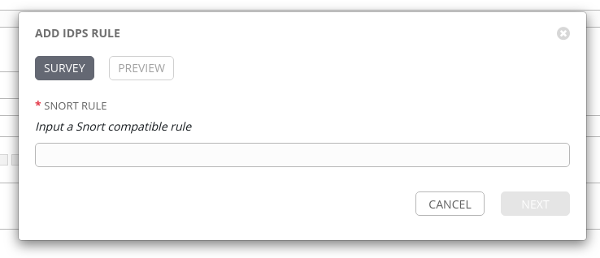

# 演習 2.2 - Threat hunting

## Step 2.1 - 背景

脅威の検出と対応能力は、通常、セキュリティオペレータが企業の IT を保護するために多くのツールを展開する必要があります。不足しているプロセスと多くの手動作業のため、これは適切な IT セキュリティ運用にとって深刻な課題です！

この演習では、大規模な組織でエンタープライズ・ファイアウォールを担当するセキュリティ担当者を想定しています。ここで使用するファイアウォール製品は、Check Point Next Generation Firewall です。この演習では、さまざまなチーム間の相互作用に特に焦点を当て、[Ansible Tower](https://www.ansible.com/products/tower) を使用して、これらの相互作用をどのように効率化できるかを説明します。

## Step 2.2 - 準備

このエクササイズを正しく動作させるには、プレイブック `whitelist_attacker.yml` を少なくとも 1 回実行しておく必要があります。また、Check Point SmartConsole 管理インターフェイスで、攻撃者のホワイトリスト・ポリシーのロギングが有効になっている必要があります。これらの操作は、演習1 Check Point の演習で行いました。手順を未実施の場合には、playbookを実行し、手順に従ってロギングを有効にしてから、ここに戻ってください。

## Step 2.3 - Tower のセットアップ

準備にはさらに2つのステップが必要ですが、前回の演習とは対照的に、Tower を使用して行います。あなたの Tower のインストールはすでにユーザー、インベントリ、クレデンシャルなどで埋め尽くされており、直接使用することができます。それを見てみましょう。Tower はブラウザ経由でアクセスします。個人の Tower インスタンスへの URL が必要です。これはあなたの VS Code Online エディタの URL に似ていますが、`-code` を除いたものです。ワークショップのページにもあります:


> **Note**
>
> この URL とログイン情報は一例です。あなたの Tower の URL とログイン情報は異なります。

ブラウザを開き、Tower インスタンスへのリンクを入力します。学生 ID と与えられたパスワードでログインします。左側にダッシュボードとナビゲーションバーが表示されます。


左側の「**Templates**」をクリックします。すでに設定されているすべてのジョブテンプレートの一覧が表示されます。ジョブテンプレートとは、Ansible ジョブを実行するための定義とパラメータのセットです。インベントリ、資格情報、playbook、制限、権限など、自動化を実行するために必要なものを定義します。このリストの中で **Blacklist attacker** というエントリを見つけて、その右にあるロケットマークをクリックします:


これをクリックすると、ジョブの概要が表示され、自動化ジョブの実行からのライブデータと、ジョブに関連するすべてのパラメータの概要が表示されます。この自動化の実行では、2台のマシン間でパッケージをドロップするようにファイアウォールの既存のポリシーを変更しました。

あとは攻撃です。前回の演習とは異なり、playbook を書いて実行するわけではありませんが、今回も Tower を使って攻撃を開始します。左側のナビゲーションバーで、**Templates**をクリックします。テンプレートのリストの中から **Start DDOS attack simulation** というテンプレートを見つけて、右のロケットアイコンをクリックして実行します。これにより、数秒ごとに攻撃がシミュレートされます。

これで舞台は整いました。このユースケースがどのようなものなのか、お読みください。

## Step 2.4 - 攻撃を確認する

あなたは、大規模な企業のファイアウォールを担当するセキュリティ・オペレータです。Check Point Next Generation Firewall（NGFW）が適用しているポリシーが、ビジネス・ラインのアプリケーションを保護するために繰り返し違反されていることがわかりました。これを確認するには、Windows ワークステーションの SmartConsole を開き、Check Point の管理サーバにアクセスして、左側の **LOGS & MONITOR** タブをクリックします。新しいウィンドウが開き、2 つの選択肢が表示されます。**Audit Logs** と **Logs** の 2 つの選択肢が表示されます。**Logs** をクリックして、実際のログを表示します:


**http Traffic Dropped**といる説明が付いた一連のめっせーが表示され、時間の経過とともに何度も繰り返し表示されます。

> **Note**
>
> ログが表示されない場合は、自動更新が有効になっていない可能性があります。その場合は、対応するボタン(円の横に A があるアイコン)をクリックしてください:


これらの違反を見て、それが攻撃の結果であるかどうかを評価するために調査を開始する必要があります。調査する最善の方法は、ファイアウォールのログと、ネットワークに展開されている他のセキュリティソリューション（Snort など）が生成したログを、QRadar のようなログ管理ツールで相関させることです。

## Step 2.5 - ログを QRadar に転送する

しかし、多くの企業環境では、前述したように、セキュリティソリューションは互いに統合されておらず、大規模な組織では、異なるチームが IT セキュリティの異なる側面を担当しており、共通のプロセスがありません。私たちのシナリオでは、セキュリティ担当者が問題をエスカレートして調査を開始するための典型的な方法は、セキュリティ分析チームに連絡し、ルール違反を特定するために使用したファイアウォールログを手動で送信してから、返信を待つというものでした。これでは、時間のかかる手動のプロセスになってしまいます。

しかし、最後の演習で示したように、Ansible を使ってこのプロセスを自動化することができます! Ansible Tower のような中央の自動化ツールを介して提供される playbook の形で、事前に承認された自動化ワークフローを用意することができます。このような Ansible の playbook のセットを使えば、脅威の調査の状況に陥るたびに、企業のファイアウォールのイベント/ログを QRadar インスタンスに送信するように自動的に設定し、セキュリティアナリストがデータを相関させ、潜在的な脅威に対してどのように対処するかを決定するために使用することができます。

これを試してみましょう。Tower インスタンスをログアウトし、ファイアウォールのユーザーとしてログインします。`opsfirewall` でログインします。デモを簡単にするために、パスワードは Student と同じにしています。ログインしてダッシュボードが表示されたら、**Templates** に移動します。ご覧のように、ファイアウォール管理者としては、いくつかのジョブテンプレートしか見ることができず、実行することができません:

- **Blacklist attacker**
- **Send firewall logs to QRadar**
- **Whitelist attacker**

私たちはファイアウォールのドメイン所有者なので、これらのジョブテンプレートを変更、削除、実行することができます。テンプレートの横にある小さなロケットアイコンをクリックして、**Send firewall logs to QRadar** を実行してみましょう。ジョブの実行には数秒かかります。ファイアウォールオペレータの視点では、中央のSIEMにログを送信するようにファイアウォールを再設定しました。

しかし、SIEM はログを受け入れ、QRadar ではログソースと呼ばれる適切なストリームに振り分ける必要があります。セキュリティアナリストの視点に切り替えてみましょう。ファイアウォールに何か奇妙なものがあり、ログがすでに我々の方向に送信されているという連絡を受けます。Tower からログアウトして、ユーザ `analyst` としてログインします。再度、**Templates** をチェックアウトしてみましょう。SIEM にファイアウォールログを受け入れてみましょう: **Accept firewall logs in QRadar** ジョブテンプレートを実行してください。

数秒後に playbook が実行され、新しいセキュリティ設定が完了します。前の演習とは対照的に、これらのステップでは、オペレータやアナリストがコマンドラインにアクセスしたり、playbook を書いたり、ロールやコレクションをインストールしたりする必要はありませんでした。playbook は事前に承認されており、実際には Git リポジトリ内からアクセスできます。Tower は、ロールやコレクションの実行とダウンロードを担当しました。これにより、自動化作業が大幅に簡素化されました。

右側の **Jobs** をクリックすると、以前に実行したジョブにいつでもアクセスすることができます。これにより、チームはいつ何が実行され、どのような結果が得られたかをよりよく追跡することができます。これにより、実行された自動化の透明性と明確な理解が可能になります。

## Step 2.6 - 新しい構成を確認する

QRadar のログが表示されるようになったことを早速確認してみましょう。QRadar の Web UI にログインします。**Log Activity**をクリックして、Check Point から QRadar にイベントが送信されていることを確認してください:


> **Note**
>
> ログが表示されない場合は、**View** の隣にあるドロップダウンメニューをクリックして、**Real Time (streaming)** を選択します。

ログが QRadar 自身のログにかき消されてしまう場合は、フィルタを作成します。または、**Log Source** の欄で不要なログ行をクリックして、**Filter on Log Source is not ...** を選択すると、その場でフィルタを作成して、不要なトラフィックをフィルタリングします。

QRadar でもログソースが正しく表示されることを確認してみましょう。QRadar UI で、左上隅のハンバーガーボタンをクリックし、**Admin** をクリックします。その中で、**Log Souces** をクリックします。新しいウィンドウが開き、新しいログソースが表示されます。


## Step 2.7 - 攻撃

次に、QRadar に表示される攻撃を管理したいと思います。現在は生成されていませんが、このユースケースのためにいくつかはすでに設定されているのでしょうか？ QRadar の Web UI で、**Offenses** タブを開きます。左側のメニューで、**Rules** をクリックします。上の **Group** の隣にあるドロップダウンメニューをクリックして **Ansible** を選択します。このワークショップのすべての事前設定された違反ルールが表示されます:


**Ansible Workshop DDOS Rule**というルールをダブルクリックします。ルール ウィザード ウィンドウが開き、必要に応じて攻撃ルールを変更することができます:


ウィザードからは、我々は唯一の非常にチェック（ウィンドウ内の2番目のボックス）を使用していることがわかります。ルールは、はるかに複雑にすることができ、さらに他のルールに依存することができ、その結果、攻撃を作成する必要はありませんが、例えば、追加のログエントリを作成することができます。我々は、ここでは変更を行いませんので、右下の**Cancel**をクリックしてウィザードを残し、ブラウザのクローズ警告を確認します。

この違反が偽陽性かどうかを判断するには、他のソースがファイアウォールでは見られない攻撃を実行していないことを確認する必要があります。そのためには、IDS が生成したログにアクセスして、ファイアウォール上の違反と互換性のある特定の攻撃パターンをチェックする必要があります。

## Step 2.8 - Snort ルールを追加する

新しい IDS ルールを追加しましょう。ここでも、Tower に既にある事前承認済みの playbook を使って行います。Tower をログアウトし、ユーザー `opsids` - IDPS を担当する IDPS オペレータとしてログインします。**Templates** に移動します。Snort にルールを追加するための playbook が用意されています。小さなロケットのアイコンをクリックして実行してください。しかし、ご覧のように、ジョブの出力に持ってくるのではなく、アンケートに直面するでしょう:



playbook はそれ以上の内容がないと実行できません。もちろん、Snort では、追加する必要のあるルールは実際のユースケースに依存するため、毎回異なる可能性があります。したがって、このジョブテンプレートでは ***survey*** を有効にしています。これは Ansible Tower で実行前に入力を問い合わせるためのメソッドです。

この場合、適切な署名、この特定の攻撃に適した Snort ルールを照会します。フィールドに次の文字列を入力します:

```
alert tcp any any -> any any (msg:"Attempted DDoS Attack"; uricontent:"/ddos_simulation"; classtype:successful-dos; sid:99000010; priority:1; rev:1;)
```

ご覧のように、攻撃のパラメータにマッチする新しい snort ルールを追加しました。この例では、再びURIの内容をチェックします。文字列を追加したら、**Next** をクリックし、**Launch** をクリックします。

playbook は、新しいルールをインストールしたり、サービスを再起動したりするなどの面倒を見てくれます。

Snort インスタンス上の新しいルールを素早く検証します。VS Code Online エディタのターミナルから、ユーザ `ec2user` で SSH 経由で Snort にログインします:

```bash
[student<X>@ansible ~]$ ssh ec2-user@11.22.33.44
Last login: Fri Sep 20 15:09:40 2019 from 54.85.79.232
[ec2-user@snort ~]$ sudo grep ddos_simulation /etc/snort/rules/local.rules
alert tcp any any -> any any  (msg:"Attempted DDoS Attack"; uricontent:"/ddos_simulation"; classtype:successful-dos; sid:99000010; priority:1; rev:1;)
```

> **Note**
>
> また、`systemctl status snort` で Snort サービスが実行されていることを確認してください。致命的なエラーがある場合は、入力したルールにエラーがあった可能性があります。ファイル `/etc/snort/rules/local.rules` からルールの行を削除し、playbook を再度実行する。

ルールを確認したら、`exit` コマンドで Snort サーバを離れます。

次に、ルールがヒットした場合に IDPS が QRadar にログを送信するようにしたいと思います。ユーザ `opsids` として対応するジョブテンプレートを実行することができます。IDPS オペレータが用意された playbook を実行するのではなく、Ansible Tower がどのようにして他の人に実行権限を委譲し、ドメインの制御を取らせることなく実行できるかを示したいと思います。

アナリストチームと IDPS オペレータチームが、IDPS から QRadar にログを転送するための事前定義された playbook に合意したとします。IDPS チームはこの playbook の作成に関与し、同意したので、アナリストチームに提供し、必要なときにいつでも実行できるようにします。

Tower からログアウトして、ユーザー `analyst` として再ログインしてください。**Templates**セクションには、複数の playbook があります:

- **Accept firewall logs in QRadar**
- **Accept IDPS logs in QRadar**
- **Roll back all changes**
- **Send IDPS logs to QRadar**

2つの **Accept...** ジョブテンプレートのみがアナリストのものであり、小さなゴミ箱のアイコンが示すように、変更や削除が可能です。ジョブテンプレート **Send IDPS logs to QRadar** は、IDPS チームが実行権限のためだけに提供しているもので、変更や削除はできません。このようにして、自動化を実行する権利はチームの境界を越えて提供され、変更や変更の権利はドメイン知識を持つチーム（ここでは IDPS チーム）にあります。IDPS へのアクセスには SSH キーが必要です。IDPS にアクセスするには SSH キーが必要です。これらはジョブテンプレートで参照されていますが、ユーザーアナリストは Tower の **Credentials** セクションでその内容を調べることはできません。このようにして、自動化を実行する権利とターゲットマシンにアクセスする権利を分離することが保証されます。

ジョブテンプレートの横にある小さなロケットのアイコンを押して、**QRadar** のIDPS ログを受け入れる**と**QRadar**にIDPSログを送信する**の両方のジョブテンプレートを実行します。

## Step 2.9 - ホワイトリスト IP

すぐに私たちの SIEM QRadar を見てみましょう: ログアクティビティタブにアクセスします。QRadar で IDS からの **no** イベントが生成されていないことを確認してください。そうすれば、あなたが見る異常がファイアウォールにある単一の IP によってのみ引き起こされていることを確実に知ることができます。他のトラフィックが異常の原因となっていないため、表示された異常は偽陽性であると考えることができます。

> **Note**
>
> 実際には、マシンの動作を分析する追加のステップを実行して、マシンが危険にさらされている可能性を除外することができます。

ホストが攻撃を行っていないと判断し、最終的にファイアウォールのポリシー違反が誤検知であることを確認しましたが、これはおそらくそのアプリケーションのホワイトリストグループの設定ミスによるものだと思われます。そこで、ファイアウォール内のIPをホワイトリスト化して、イベントを通過させることができます。

Tower をログアウトし、ユーザ `opsfirewall` として再ログインします。Templates** の概要に移動し、ジョブテンプレート **Whitelist attacker** を起動します。しばらくするとトラフィックが許可されます。

## Step 2.10 - ロールバック

分析者は脅威の探索を終了しました。リソースの消費と分析作業を削減するために、Check Point と Snort ログの構成を調査前の状態に戻すことが推奨されます。これを行うには、事前に承認されたジョブ テンプレートを使用します:

- **Roll back all changes**

Ansible Tower にユーザー `analyst` としてログインし、その横にある小さなロケットアイコンをクリックして実行します。すぐにすべてのロギング設定が通常の状態に戻ります。

最後に、攻撃シミュレーションを止めなければなりません。Tower をログアウトし、学生ユーザーとしてログインします。**Templates** のセクションで、**Stop DDOS attack simulation** というジョブテンプレートを見つけて実行します。

これでエクササイズは終了です。次のエクササイズを続けるために、エクササイズのリストに戻ってください。

----

[こちらをクリックし、Ansible Security Automation Workshop に戻ります](../README.md#section-2---ansible-security-automation-use-cases)
