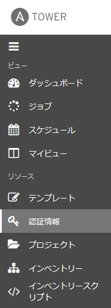
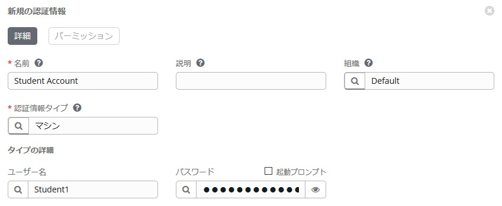
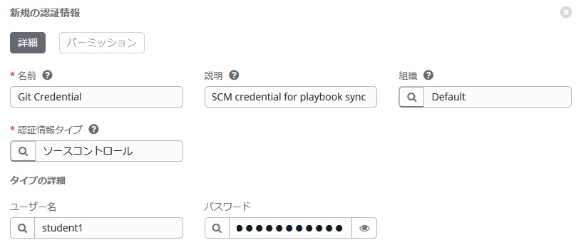
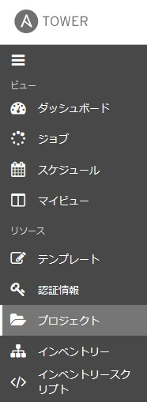
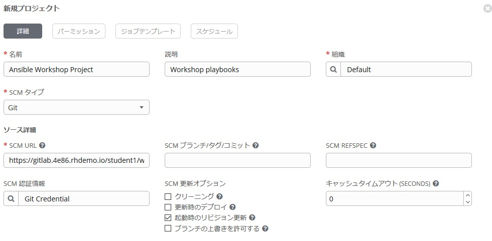
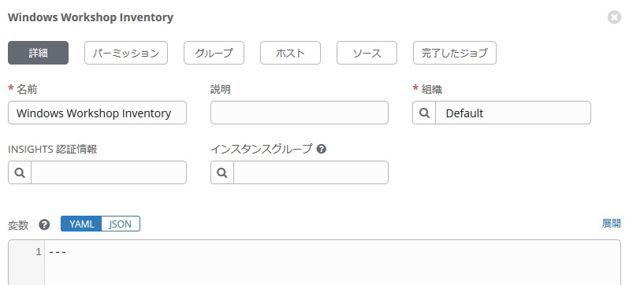
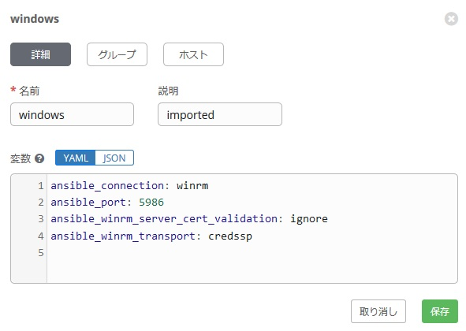
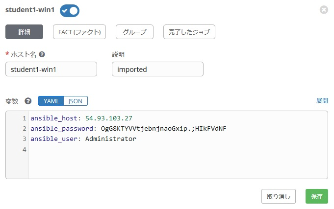

# 演習 1 - Ansible Towerの概要と構成  

**別の言語で読む**: [English](README.md),  [日本語](README.ja.md),  [Français](README.fr.md).
 

Ansible Tower には、マルチテナント、通知、スケジューリングなどの機能を提供する多くのオブジェクトがあります。ここでは、ワークショップに必要な以下の重要なものに焦点を当ててご説明します。インベントリーなど、Ansible Engine でおなじみのオブジェクトもありますし、Ansible Tower 独自のオブジェクトもあります。♬  

- 認証情報  

- プロジェクト  

- インベントリー  

- ジョブテンプレート  

## Tower へのログイン  

各自に準備された Ansible Tower のインスタンス情報は講師にご確認ください。  
演習用の Ansible Tower には既にライセンスファイルが適応されていますので、ログインするとダッシュボードが表示されます。  

## 認証情報の作成  

Ansible Tower は、Windows や Linux、ネットワーク機器など管理対象ノードに対するジョブの実行、AWS や VMware vCenter Server などのインベントリーソースとの情報の同期、Git などソースコード管理システムとの同期の際に必要となる個々の認証情報をあらかじめ登録した上で利用する事が出来ます。  

[認証情報](http://docs.ansible.com/ansible-tower/latest/html/userguide/credentials.html#credential-types)にはたくさんの種類があります。  
このワークショップでは認証情報として、**マシン**と**ソースコード管理システム**の認証情報を作成し、利用します。  

### ステップ 1:  

左側のパネルから「認証情報」を選択します  

  

### ステップ 2:  

 アイコンをクリックして新しい認証情報を追加します。  

### ステップ 3:  

次のエントリを使用してフォームに入力します。  

| キー          | 値           |                                          |  
|--------------|-----------------|------------------------------------------|  
| 名前          | Student Account|                                          |  
| 組織          | Default         |                                          |  
| Type         | マシン         |                                          |  
| Username     | student#        | **# の部分は各自の番号に置き換えてください**  |  
| Password     | *****           | student password に置き換えてください |  

  

### ステップ 4:  

 をクリック    

## SCM 認証情報の作成  

最初の認証情報は、Windowsマシンにアクセスするためのものです。次に、ソースコードリポジトリ (Git) にアクセスするための認証情報を作成してみます。以下の情報を参考に、先ほどと同じように作成してみてください。  

| キー          | 値                            |                                            |  
|--------------|----------------------------------|--------------------------------------------|  
| 名前         | Git Credential                   |                                            |  
| 説明  | SCM credential for playbook sync |                                            |  
| 組織 | Default                          |                                            |  
| 認証情報タイプ | ソースコントロール                   |                                            |  
| ユーザー名     | student#                         |  **# の部分は各自の番号に置き換えてください**    |  
| パスワード     | *******                          | student password に置き換えてください |  

 をクリック    

  

## プロジェクトの作成   

プロジェクトは、Playbook を管理する仕組みを提供します。 Playbook と Playbook ディレクトリを管理するには、Tower サーバーの /var/lib/awx/projects/ 配下に手動で配置するか、Git、Subversion、Mercurialなど、Tower でサポートされるソースコード管理（SCM）システムに Playbook を配置します。  

### ステップ 1:  

左パネルで **プロジェクト** をクリックします。  

  

### ステップ 2:  

 アイコンをクリックし、新規プロジェクトを作成します。  

### ステップ 3:  

次のエントリを使用してフォームに入力します (**SCM URL の欄にはこのワークショップ名（英数字4文字）と各自の Studente 番号を使ってください**)  
オプションでは**起動時のリビジョン更新**にチェックを入れます。  

| キー            | 値                                                                   |                                                   |  
|----------------|-------------------------------------------------------------------------|---------------------------------------------------|  
| 名前           | Ansible Workshop Project                                                |                                                   |  
| 説明    | Workshop playbooks                                                      |                                                   |  
| 組織   | Default                                                                 |                                                   |  
| SCM タイプ       | Git                                                                     |                                                   |  
| SCM URL        | https://gitlab.**WORKSHOP**.rhdemo.io/**student#**/workshop_project.git | **WORKSHOP と student# は今回のワークショック名（英数字4文字）と各自のStudent番号に変更ください** |  
| SCM ブランチ     |                                                                         | Intentionally blank                               |  
| SCM 認証情報 | Git Credential                                                          |                                                   |  
SCM 更新オプション  

- [ ] クリーニング   
- [ ] 更新時のデプロイ  
- [x] 起動時のリビジョン更新  

  

### ステップ 4:  

　をクリックします。  

### ステップ 5:  

下にスクロールして、プロジェクトの保存時に、Git に対して正常に同期されたことを確認します。ページ下部のリストビューで、プロジェクト名の左横に緑色の丸が表示されていることを確認します。  

  

## インベントリー  

管理対象のホストをインベントリーと呼びます。これは Ansible Engine と同じですね。インベントリーはグループに分割することも可能で、これらのグループには実際のホストの一覧が含まれています。インベントリーには、Ansible Tower に直接ホスト接続情報を入力する静的インベントリーと、Ansible Towerでサポートされている、AWS やAzure、などクラウドや、vSphere などの仮想環境からインベントリー情報を取得して登録する動的インベントリーがあります。  

今回の演習では、静的インベントリーがすでに作成されています。ここで、このインベントリーを見て、その書き方について確認してみます。  

### ステップ 1:  

左側のパネルで **インベントリー** をクリックします。事前に作成されたインベントリー情報が見えます。    
**Windows Workshop Inventory** という名前のインベントリーもしくは編集アイコン 　をクリックします。    

### ステップ 2:  

インベントリーの内容が表示されています。ここからホストやグループや変数など、このインベントリーに関する情報を追加する事が出来ます。  

  

**ホスト** ボタンをクリックすると対象ホストがリスト表示されます。  

### ステップ 3:  

ホストビューでは、このインベントリーに関連付けられているすべてのホストが確認できます。また、ホストが関連付けられているグループも表示されます。  
ホストは複数のグループに関連付けることができます。Playbook の実行はこのインベントリー全体でも可能ですし、このグループを指定した実行も可能です。    

  

### ステップ 4:  

**グループ** ボタンをクリックし **Windows** を選択すると、このグループに対して適応している変数を見る事が出来ます。Windows の場合は接続に WinRM を利用しますので、その情報とポート番号などが記載されています。    

  

この演習では、特定のホスト（この例では Windows ホスト）に接続する方法を『グループ内の変数』として定義しました。ただ、必ずここに記載しないといけない、というわけではなく、ホスト毎の変数として定義することも出来ますし、テンプレートや、Playbook の中に定義することも可能です。    

各変数の意味については以下の通りです。  

Ansible はデフォルトでは ssh での接続を試みます。Windows では ssh ではなく、WinRM での接続となりますので、その旨 Ansible に教えてあげる必要があります。その手段が、ansible_connection という変数です。    
[WinRM](https://docs.ansible.com/ansible/latest/user_guide/windows_winrm.html).  

**`ansible_connection: winrm`**  

また、AnsibleにWinRM SSLポート5986に接続するよう指示します（非SSLポートで、暗号化されないポート番号は5985です）    

**`ansible_port: 5986`**  

また、演習環境では適切な証明書ストアのセットアップがないため、Ansibleに WinRM 証明書を無視するように指示します。    

**`ansible_winrm_server_cert_validation: ignore`**  

Windowsには様々な接続時の認証方法があります。ここでは、**CredSSP** を使用して Windows ホストへの認証を行うよう Ansible に指示します。  

**`ansible_winrm_transport: credssp`**  

**ホスト** ボタンをクリックすると windows グループに所属するホスト一覧が表示されます。このページでホストのリンクをクリックすると、定義されているホスト固有の変数を確認する事が出来ます。  

  

**`ansible_host`**  

このサーバーのIPアドレスを定義する変数です。  

**`ansible_password`**   

このサーバーに接続するためのパスワードを定義する変数です。  

**`ansible_user`**  

このサーバーに接続するためのユーザーを定義する変数です。  

これらの変数はホスト固有であるため、グループレベルではなくホストレベルで定義されています。  

その他の設定についてはこちらをご参照ください。  
[Windows Guides](https://docs.ansible.com/ansible/latest/user_guide/windows.html).
認証設定は特に重要であり、それらを確認して、ニーズに合わせて最適な方法を決定する必要があります。  

## まとめ  

これで、Ansible Tower の基本設定は完了です。 演習2では、これらのホストに対し、いくつかの Ad-Hoc コマンドを実行します。  

[ワークショップ一覧に戻る](../readme.ja.md)
